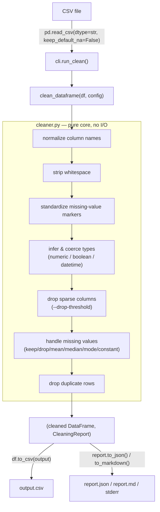

# datacleaner — a defensive CSV cleaning CLI

> Clean a messy CSV — missing values, mixed types, duplicates, ragged whitespace — into a tidy CSV plus a structured report of exactly what changed and why.


> **AI Engineer Roadmap — Project 0.1**
> *Teaches: pandas, NumPy, defensive coding, argparse.*

## What it does

`datacleaner` takes a messy CSV and produces a **clean CSV plus a structured summary
report** (JSON or Markdown) of everything it did: renamed columns, inferred types,
missing-value counts before/after, duplicates removed, cells imputed.

Design principles:

- **Pure core, thin shell.** All cleaning lives in `clean_dataframe()`, which does no
  I/O — the CLI only parses args and reads/writes files. This makes the logic
  trivially unit-testable and reusable from notebooks.
- **Defensive coercion.** A column is only converted to a new numeric or datetime
  type if the conversion introduces no new missing values. A column that merely
  *looks* numeric, or a forced `--datetime-cols` column whose values don't all
  share one date format, is left untouched rather than silently corrupted.
- **Observable.** Every run returns a `CleaningReport` (rows/cols before & after,
  renamed columns, inferred types, per-column missing counts, duplicates removed,
  cells imputed).
- **No silent data invention.** `mean`/`median` imputation only touches numeric
  columns; text/categorical columns are left missing rather than filled with a
  fabricated mode.
- **Version-robust.** Works across the `object` → `StringDtype` change in modern
  pandas via a single `_is_textual()` helper.

## Architecture



The CLI (`cli.py`) is a thin shell around `clean_dataframe()`: it parses arguments,
reads the input CSV as all-`str` columns (so the cleaner — not pandas — decides what
counts as missing), builds a `CleaningConfig`, calls the pure pipeline, then writes
the cleaned CSV and renders the `CleaningReport` via `report.py`.

## Quickstart

Requires Python 3.10+.

```bash
# from the project root
python -m venv .venv
source .venv/bin/activate         # Windows: .\.venv\Scripts\activate
pip install -e ".[dev]"           # installs the package + pytest
```

This registers a `datacleaner` console command (verified working via
`python -m datacleaner` against `pyproject.toml`'s `[project.scripts]` entry point).

```bash
# Clean with sensible defaults; prints a Markdown summary to stderr,
# writes messy.clean.csv next to the input.
datacleaner clean sample_data/messy.csv

# Impute missing numbers with the column median, force-parse a date column,
# and save a JSON report.
datacleaner clean sample_data/messy.csv \
    -o cleaned.csv \
    --report report.json \
    --missing median \
    --datetime-cols signup_date

# Drop any row with a missing value, and drop columns that are >90% empty.
datacleaner clean sample_data/messy.csv --missing drop --drop-threshold 0.9

# Or run as a module without installing:
python -m datacleaner clean sample_data/messy.csv
```

### Options

| Flag | Description |
| --- | --- |
| `-o, --output PATH` | Output CSV path (default `<input>.clean.csv`). |
| `--report PATH` | Report path. `.json` → JSON, anything else → Markdown. Omit to print to stderr. |
| `--missing {keep,drop,mean,median,mode,constant}` | Missing-value strategy (default `keep`). |
| `--fill-constant VALUE` | Value used with `--missing constant`. Passed through as a string — see [Limitations](#limitations). |
| `--drop-threshold FLOAT` | Drop columns whose missing fraction exceeds this (0–1). |
| `--datetime-cols COL ...` | Columns to force-parse as datetimes. |
| `--dup-subset COL ...` | Columns that define a duplicate (default: whole row). |
| `--no-normalize-columns` | Keep original column names. |
| `--no-infer-types` | Skip numeric/datetime/boolean coercion. |
| `--no-drop-duplicates` | Keep duplicate rows. |
| `-v, --verbose` | Verbose logging. |

## What the pipeline does (in order)

1. **Normalize column names** — `"Customer ID " → "customer_id"`, de-duplicated.
2. **Strip whitespace** from every string cell.
3. **Standardize missing markers** — `""`, `NA`, `n/a`, `null`, `-`, `?`,
   `unknown`, … all become real `NaN`.
4. **Infer & coerce types** — numeric (`Int64`/`float64`), `boolean`
   (yes/no/true/false/1/0), and datetime — only when safe, i.e. when the coercion
   introduces zero new missing values (applies to both auto-inferred types and
   forced `--datetime-cols` columns).
5. **Drop sparse columns** (optional, via `--drop-threshold`).
6. **Handle missing values** — `keep` / `drop` / `mean` / `median` / `mode` /
   `constant`.
7. **Drop duplicate rows** (optionally keyed on a column subset).

Order matters and is explained in the module docstring of `cleaner.py` — e.g.
missing markers are standardized *before* type inference so a column of
`["1", "2", "NA"]` can still become numeric.

## Example output

Running the second Quickstart example above
(`datacleaner clean sample_data/messy.csv -o cleaned.csv --report report.json --missing median --datetime-cols signup_date`)
on the included `sample_data/messy.csv` (9 messy rows) produces a 7-row clean CSV and
this report (verified by re-running it):

```
## Overview
- Rows: 9 -> 7 (-2)
- Columns: 7 -> 7 (+0)
- Duplicate rows removed: 2
- Cells imputed: 4

## Inferred types
- customer_id -> Int64
- age         -> Int64
- spend       -> float64
- active      -> boolean

## Missing values per column
| Column       | Before | After |
| ------------ | -----: | ----: |
| signup_date  |      2 |     1 |
```

Note that `signup_date` is *not* listed under "Inferred types": `messy.csv` mixes
date styles (`2021-03-01`, `2021/04/15`, `15-05-2021`, …), so forcing the whole
column to `datetime64` would turn some valid-but-differently-formatted dates into
`NaT`. The datetime guard (mirroring the numeric-coercion guard) detects that and
leaves the column as plain strings instead — the `signup_date` row above only
drops from 2 missing to 1 because a duplicate row (also missing that field) was
removed, not because of any lossy coercion.

## Project structure

```
data-cleaning-cli/
├── src/datacleaner/
│   ├── __init__.py      # public API (CleaningConfig, CleaningReport, clean_dataframe)
│   ├── __main__.py      # `python -m datacleaner`
│   ├── cli.py           # argparse + file I/O (the thin shell)
│   ├── cleaner.py       # the pure cleaning pipeline (the core)
│   └── report.py        # JSON / Markdown rendering of a report
├── tests/
│   ├── test_cleaner.py  # unit tests for each pipeline step
│   └── test_cli.py      # end-to-end CLI tests
├── sample_data/         # example input (messy.csv) and example generated output
├── pyproject.toml
└── requirements.txt
```

## Key design decisions

- **Read everything as `str` first** (`pd.read_csv(..., dtype=str, keep_default_na=False)`),
  then let the cleaner's own token list decide what's missing — pandas' default NA
  sniffing is bypassed so behavior is deterministic and explicit.
- **Config and report are plain dataclasses**, not hidden globals or a dict soup —
  a run is fully reproducible from one `CleaningConfig`, and a `CleaningReport` is
  trivially serializable to JSON/Markdown.
- **Numeric and forced-datetime coercion are both guarded**; a column is only
  promoted to `Int64`/`float64`/`datetime64[ns]` if doing so creates zero new
  missing values versus the pre-coercion column.

## Limitations

- **Forced datetime coercion (`--datetime-cols`) is guarded like numeric
  coercion, not more clever than it.** `pd.to_datetime` infers a single date
  format from the column and applies it to every row; if that would turn any
  valid-but-differently-formatted value into a *new* `NaT`, the guard refuses
  the whole-column coercion and leaves it as strings rather than silently
  losing data (see the "Example output" section above, where `signup_date` is
  left uncoerced for exactly this reason). This is safe but coarse: the column
  is either fully coerced or not coerced at all, never partially. If you need a
  mixed-format date column actually parsed, normalize its formatting upstream
  first.
- **`--fill-constant` is always passed through as a string.** Using
  `--missing constant --fill-constant 0` on a numeric column will not fill it with
  the number `0`; pandas rejects the typed fill and the code falls back to
  converting the whole column to `object` dtype with mixed native/string values.
  Prefer `--missing mean`/`median`/`mode` for numeric columns, or fix the column's
  dtype afterward if you must use `constant`.
- **No streaming / chunking.** The whole CSV is loaded into memory via pandas; very
  large files are not handled specially.
- **No CI.** The test suite (22 tests, `pytest -q`) is complete but only runs
  locally today.

## Roadmap

- Coerce `--fill-constant` to a number when possible instead of always treating it
  as a string.
- Add a GitHub Actions workflow to run `pytest` on push/PR.
- Ship a `py.typed` marker for downstream type-checking.
- Surface silent fallbacks (e.g. `--dup-subset` columns that no longer exist) in
  `CleaningReport` instead of only in code comments.

## Running the tests

```bash
pytest -q          # 22 tests covering each pipeline step + the CLI
```

## License

MIT.
